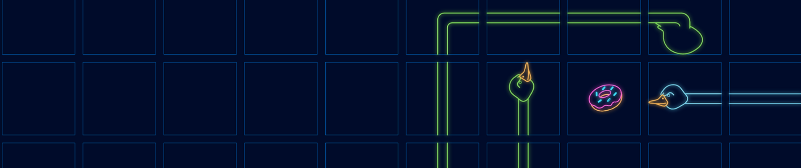

# hungry_geese

Multiplayer agent competition in a Snake like environment

https://www.kaggle.com/c/hungry-geese

## Methodology

I'm following [CRISP-DM 1.0](https://www.the-modeling-agency.com/crisp-dm.pdf) methodology for the reports.

I have skipped Evaluation and Deployment steps because they are not usually done on Kaggle.

1. [Business understanding](reports/01_Business_Understanding.md)
1. [Data understanding](reports/02_Data_Understanding.md)
1. [Data preparation](reports/03_Data_Preparation.md)
1. [Modeling](reports/04_Modeling.md)
1. [Solution summary](reports/05_Solution_Summary.md)
1. [Challenge workflow](reports/00_Challenge_Workflow.md)

## Code structure

     |_ source
     |_ forum: all the scritps and notebooks taken from the forum
     |_ logs: folder for storing all kind of stats and logs. For example the
     score of each model, results from experiments
     |_ notebooks: jupyter notebooks made during the challenge. They start by number for easier sorting.
     |_ reports: documents made during the challenge according to CRISP-DM methodology
     |_ tests: folder with tests for the library
     |_ data: folder with light data from teh challenge
     |_ rules: the official rules of the challenge

## Final solution code

The code to train, play and evaluate the final solution is located on `scripts/efficient_deep_q_learning`.
Once trained an agent can be created with this script `scripts/q_value_submission/create_semisafe_q_value_agent.py`
