# Modeling

## Select modeling technique

<!---Document the actual modeling technique that is to be used. If multiple
techniques are applied, perform this task separately for each technique.
Many modeling techniques make specific assumptions about the data—for example,
that all attributes have uniform distributions, no missing values allowed,
class attribute must be symbolic, etc. Record any such assumptions made. --->

I will be using Reinforcement Learning techniques in this challlenge.

## Generate test design

<!---Describe the intended plan for training, testing, and evaluating the models.
A primary component of the plan is determining how to divide the available dataset
into training, test, and validation datasets.

Doing a plot of score vs train size could be helpful to decide the validation strategy

Depending on the size of the data we have to decide how we are going to use submissions.
The less the submissions the most confidence we can have on the score. However sometimes
the data distribution is very different, or the size of the data is small and we have
to make a lot of submissions. Sometimes is not easy to have a good correlation between
validation score and LB score
--->

I have decided to implement an internal league of agents to measure progress. Ideally I could train
my models completely isolated from Kaggle and submit a single perfect agent to the leaderboard.
That would be very epic.

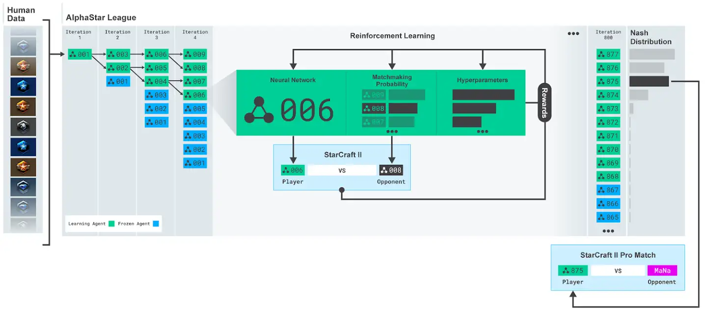

### Theory about ranking

[Youtube Ranking Systems: Elo, TrueSkill and Your Own](https://www.youtube.com/watch?v=VnOVLBbYlU0)

#### [Elo rating system](https://en.wikipedia.org/wiki/Elo_rating_system)

Having a score 400 points higher means that you will win 90% of the times. If the number of matches is big enough the players will reach equilibrium.

In our case Agents are stationary, they do not improve over time. So I only need to find the relative position to existing agents.

Problems could arise if a new agent is not able to win all the previous agents. In that case the
rating will not converge unless the match distribution is fixed. So I have to create an environment
where each new agent is trained against all previous ones and learns to beat them all.

Some links:

- [Elo sucks — better multiplayer rating systems for smaller games](https://medium.com/acolytefight/elo-sucks-better-multiplayer-rating-systems-for-smaller-games-8ca588ee652f)
- [Multiplayer Elo](http://www.tckerrigan.com/Misc/Multiplayer_Elo)

#### [TrueSkill](https://en.wikipedia.org/wiki/TrueSkill)

TrueSkill is more complex and powerful than Elo, and I think it is used on Kaggle or something similar.

However I think Elo is enough for my problem and I will use it.

### Ranking definition

- I will use Elo ranking
- I will compute ranking for hard-coded agents first, and I won't update those scores since I expect
that the RL agents will be better
- I will train a first model that is able to beat the greedy agent consistently, and then another one
that is able to beat agents 1 and 2, and so on
- Old agent scores will be fixed, and I will just compute the ranking for the new agent
- New agents will be initialized with the ranking of the best existing agent
- To adapt to multiplayer Elo I will consider that on each match the agent has won over agents with
lower score and has lose over agents with greater score

## Iteration 1. Hard coded agents

<!---
The work is done using short iterations. Each iteration needs to have a very
clear goal. This allows to gain greater knowledge of the problem on each iteration.
--->

### Goal

On a first step I'm going to develop or download from the forum hard-coded agents. This will
allow to implement the ranking system.

### Development

#### Agents from the forum

- https://www.kaggle.com/ilialar/risk-averse-greedy-goose
- https://www.kaggle.com/ilialar/goose-on-a-healthy-diet
- https://www.kaggle.com/ihelon/hungry-geese-agents-comparison
- https://www.kaggle.com/leontkh/hard-coded-passive-aggressive-agent

#### Championship

I'm going to run matches between all the agents by selecting them randomly and use the results
to compute the first Elo ranking. I will check that at least there are two different agents
on each match.

I could play with different speeds for the Elo rating and see the effect.

### Results

| model                   | ranking |
|-------------------------|---------|
| boilergoose             | 1269    |
| besthoarder             | 1227    |
| crazy_goose             | 1186    |
| risk_averse_goose       | 1176    |
| goose_on_a_healthy_diet | 1157    |
| straightforward_bfs     | 1004    |
| greedy                  | 981     |
| greedyhoarder           | 766     |
| random_plus             | 706     |
| random                  | 523     |

So this is very interesting, we have compared many hard-coded agents and see that there are much stronger agents than greedy. For example boilergoose will beat greedy agent 83% of the times.

This gives us a very good start point to train reinforcement learning agents. We should aim to create a first RL agent that scores around 1500. Then aim to 1700, 1900... and create a ladder of improving agents.

## Iteration 2. Deep Q Learning

<!---
The work is done using short iterations. Each iteration needs to have a very
clear goal. This allows to gain greater knowledge of the problem on each iteration.
--->

### Goal

I'm going to start with the simplest powerful approach that I can think of: Deep Q learning. On this
iteration I would like to see how far a model trained this way can go and how long does it take to
learn.

### Links

https://www.kaggle.com/victordelafuente/dqn-goose-with-stable-baselines3-pytorch#Using-our-custom-environment

### Game interface

In order to be able to train an agent I have to first create a game interface that provides the information
in the best way for our model.

- Transform the board into a 3d tensor
- Remember last movements
- Compute useful features
- Save the whole episode for later training

### Study Kaggle Environments library

Let's first have a look at the library to better undertand how to deal with it.

There is an [OpenAI Gym interface](https://github.com/Kaggle/kaggle-environments#training) that may
be useful to simplify training.

The other option is to use [step](https://github.com/Kaggle/kaggle-environments#stepping) on the environment.
However this requires to compute the action for all the agents.

### Development

#### Design

```bash
Agent
    Model
    State or GameInterface
        update(observation, configuration)
        render(state)
        history()
        reset()
```

Do everything with tests.

I could pretrain the Q function using matches from the best hard-coded agent.

Start with a single processor, leave the process of paralellization for the future.

#### Playing against random agents

To verify that the model is able to learn I'm going to play against random agents. It should be
easy to learn to beat them. I have been able to train a model that apparently beats the random
agent consistently, however it is struggling to beat the greedy player.

Let's evaluate the agents to verify this.

We have been able to train a model that is better than random. When it plays against 3 random
agents it beats them consistently, however that's not the case when more than one q value agents
are used, which suggest collisions.

This raises concerns also about evaluating agents when there is no upper bound. We get very
optmistic scores.

The truth ranking is around 866 points compared to 706 by random pluss and 981 by greedy.

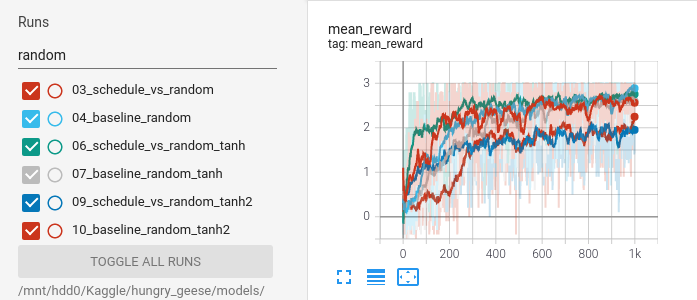

#### Playing against greedy agents

First experiments reveal a score almost identical to the greedy agent, however when using more than
one agent the score drops to 905 compared to 981 of the greedy agent.

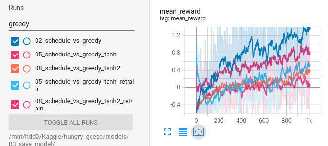

#### Pretrain the agent on random agent games

The bigger the train dataset the better, but gains are diminishing.

By pretraining the model on this data the agent is able to achieve an impressive elo score of around
1140, much better than random (706) and greedy (981). So we were able to outperform the iterative
q value learning simply by pretraining.

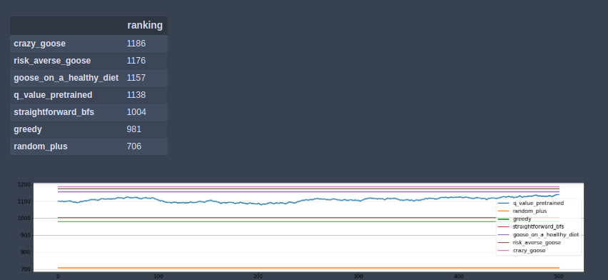

#### Pretrain the agent on epsilon-greedy or greedy agent games

After the success of pretraining on random agents it seemed logical to try with greedy or epsilon-greedy
agents pretrain. However the resulting agents are no better than the greedy agent.

My explanation for this behaviour is that the Q value function becomes too complex and the model is
unable to learn it.

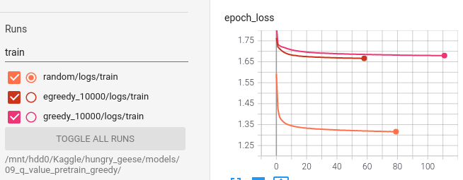

In the plot above it is seen that the loss achieved when pretraining on random agent games is
around 1.32, while for epsilon greedy agent game is 1.66 and 1.68 for greedy games. This may
suggest that the more advanced the agent the more complex the Q value function.

I have tried increasing the agent capacity but there was overfit to the train set.

### Results

- It is hard to train a model to learn the Q value function, learning rate is critical
- The Q function is not easy. It depends on the agents we are facing and on the policy of our agent.
Moreover learning the reward function is not easy, because we have to predict what the other agents
are going to do. So this is an argument in favour of learning a policy instead of a value function
- We have been able to train an agent to become better than the random agent
- We have been able to pretrain an agent on random agents game to become better than greedy agent
- We have discovered that current Q value function is very complex and difficult to learn

### Arguments against Q value function

At the start of the game there is no information to predict the Q value function.

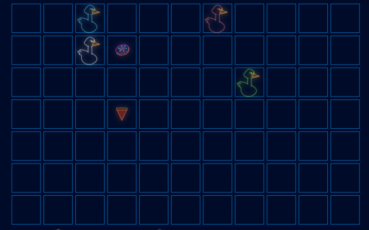

I sugggest to update the reward to be the ranking of the goose on the next step. I have to better
think about propagation of the information backwards.

## Iteration 3. Exploring other reward functions

### Goal

The goal is to see if using other reward functions may simplify the Q value function and thus enable
learning from agents such as the greedy agent.

### Development

#### Current reward function

Let's remember how the current reward function is implemented:

- If the step is not terminal the reward is zero except some of the other geese has died in the previous
step. For each dead goose the reward is 1.
- If the step is terminal then if the goose has died the reward is -1, otherwise it gets 1 for each
living smaller goose and 0.5 for living goose of the same size.

That is the definition of the reward for each state. The cumulative reward is computed by summing
all the received rewards without any discount factor. The maximum cumulative reward is 3, and the minimun
is -1.

The problems of this reward function are:

- The relation between the state of the game and the reward is undefined. For example at the start of
the game there is no way to know which agent will win so there is no option to predict the reward.
- The problem above leads to have a very big upper bound when learning the q value function

The advantages of this reward function are:

- Maximizing this reward function ensures that we maximize the expected score on the leaderboard
- Reward is given when other goose die, which encourages to be a goose killer

#### Alternative reward function proposal

To solve the problem of being undefined I propose the following reward

- If the step is not terminal give a reward that is the current ranking of the agent. Give a reward
of 1 for each smaller goose and 0.5 for each goose of the same size
- If the step is terminal and the agent dies then give a negative reward, otherwise return the ranking
as defined above

If I compute the cumulative reward by summing without discount factor then again I will have an undefined
Q value function, since the result of the episode is unknown. Instead I propose to use a discount factor,
or even better a moving average. The advantage of the moving average is that we get good bounds for the
cumulative reward, which does not happen when using discount factor. The size of the window will be a
parameter to tune, the bigger the size of the window the more the model will have to look to the future.

Advantages of this approach:

- If we use a window of 1 (do not look into the future) then the q value function is much clearly defined.
Of course there is some uncertainty because movements of the other players are unknown, but it is a much
more simpler function than the previous one
- There are still incentives to kill other gooses if they have the same size or bigger than us
- There are incentives to be bigger than the other gooses, but not to be much bigger
- Maximizing this function also leads to maximizing leaderboard score

Problems of this approach:

- The more we look into the future the more complex the function becomes, we could probably probe this
experimentally

#### Implementation

Since it is possible that I could develop new reward functions in the future, I think I should make
a function that receives a keyword and computes reward using that keyword. This will take a little
bit of more work today, but will save time in the future.

I will call the new reward the `ranking_reward`, and the previous existing reward the `sparse_reward`.

The new `ranking_reward` has two parameters:

- Reward when the agent dies
- Window for averaging rewards (backwards averaging)

I'm going to supply both parameters in the name, for example `ranking_reward_-1_2` means the reward when dying will be -1 and the window for averaging will be 2. They are probably related.

#### Pretraining on random agents game

Let's start by pretraining on random agents game to see how different the training loss and the agent's performance is when training on this loss.

| model                                                     | elo score | validation loss |
|-----------------------------------------------------------|-----------|-----------------|
| Baseline_sparse_reward_80000                              | 1140      | ~1.3            |
| 03_ranking_reward_-1_1_40000                              | 995       | 0.13            |
| 04_ranking_reward_-1_2_10000episodes                      | 1102      | 0.18            |
| 05_ranking_reward_-1_3_10000episodes                      | 1109      | 0.20            |
| 06_ranking_reward_-1_4_10000episodes                      | 1071      | 0.23            |
| 08_ranking_reward_-1_4_10000episodes_encoder_x32          | 1002      | 0.28            |
| 07_ranking_reward_-1_5_10000episodes                      | 992       | 0.25            |
| 09_ranking_reward_-2_5_10000episodes                      | 1102      | 0.39            |
| 10_ranking_reward_-4_5_10000episodes                      | 1138      | 0.79            |
| 11_ranking_reward_-4_5_80000episodes                      | 1116      | 0.751           |
| 12_ranking_reward_-4_5_80000episodes_reduce_lr_on_plateau | 1230      | 0.747           |

- The loss of the new reward function is much smaller compared to sparse reward baseline, the direct comparison is 1.3 vs 0.13
- Clearly using only 1 step lookahead is not optimal
- The number of steps looakhead and the dead reward is related, as shown by the experiments with 5 steps.
- The bigger the lookahead steps the more complex the function as shown by the validation loss
- The model with reduce lr on plateau achieves the best elo score, although training loss is similar

So this experiments probe that the loss is much smaller with the new reward, and we were able to train
a better agent than the baseline.

#### Pretraining on greedy or epsilon greedy games

| agent               | model               | elo score |
|---------------------|---------------------|-----------|
| greedy              | -                   | 981       |
| greedy              | ranking_reward_-1_3 | 1023      |
| greedy              | ranking_reward_-2_3 | 1083      |
| greedy              | ranking_reward_-4_3 | 1068      |
| epsilon 0.05 greedy | ranking_reward_-1_3 | 1121      |
| epsilon 0.05 greedy | ranking_reward_-2_3 | 1095      |
| epsilon 0.05 greedy | ranking_reward_-4_3 | 1087      |

We were able to improve over greedy agent score. It seems that epsilon greedy playing helps slightly.
With the previous reward we were unable to do this.

#### Pretraining on boilergoose games

So now we want to try to improve over the current best agent: boilergoose.

| agent                    | model               | elo score |
|--------------------------|---------------------|-----------|
| boilergoose              | -                   | 1269      |
| boilergoose              | ranking_reward_-2_3 | 744       |
| boilergoose 0.05 epsilon | ranking_reward_-2_3 | 1021      |
| boilergoose 0.02 epsilon | ranking_reward_-2_3 | 1019      |
| boilergoose 0.01 epsilon | ranking_reward_-2_3 | 1055      |
| combo1                   | ranking_reward_-2_3 | 890       |

So far I have been unable to learn a q value function that can be unrolled as a better policy than
boilergoose. If I cannot do it then I could not do either the cycle of evaluation and improvement.

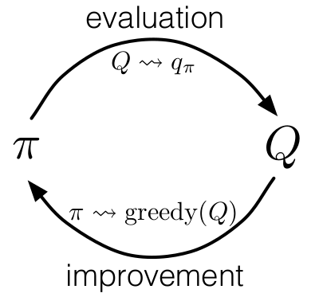

So I have to solve this problem. Maybe I need a model with more capacity.

| agent  | model | elo score | validation loss |
|--------|-------|-----------|-----------------|
| combo1 | x16   | 890       | 0.054           |
| combo1 | x32   | 1007      | 0.047           |
| combo1 | x64   | 1026      | 0.041           |
| combo1 | x128  | 1026      | 0.040           |

We were able to improve the score, but it is far from the 1269 score of the boilergoose model.

#### Improving RAM memory usage

| experiment                                   | RAM usage (%) | epoch time (s) | GPU usage(%) |
|----------------------------------------------|---------------|----------------|--------------|
| numpy array                                  | 62.26         | 11.2           | 43           |
| generators                                   | 36            | 32             | 16           |
| generator enqueuer                           | 37.9          | 25.8           | 21           |
| generator enqueuer 2 workers multiprocessing | 36.9          | 76             | 8            |
| dataset from generator                       | 36.6          | 26             | 25           |

I have tried to solve the issue of using double RAM memory than expected. However in all the experiments
that I have been able to reduce the RAM usage the epoch size has increased also a lot.

The difference in speed comes because when using numpy arrays it takes a lot of time to start the
training. So it seems to be optimizing something that it does not optimize otherwise. Maybe I need
to solve the issue with ptxas.

I have been able to solve ptxas problem, thus I want to repeat the experiments to see if anything
changes. I will be using a smaller file so I can train with both gpus so I speedup training.
Automate steps per epoch, and create a script for each experiment.

Both dataset from generator and generator enqueuer take twice the time as giving the numpy array as
input.

Using dataset from numpy array is very slow, the speed test reveals that looping over the epoch
takes 13 seconds.

| experiment             | RAM usage (%) | epoch time (s) | GPU usage(%) |
|------------------------|---------------|----------------|--------------|
| numpy array            | 33            | 4.7            | 44           |
| generator enqueuer     | 20            | 11.1           | 20           |
| dataset from generator | 20            | 10.6           | 22           |
| dataset from numpy     | 33            | 16             | 18           |

Some links:

- https://stackoverflow.com/questions/51541610/why-is-tensorflows-tf-data-package-slowing-down-my-code
- https://github.com/tensorflow/tensorflow/issues/39750
- https://github.com/tensorflow/tensorflow/issues/40634
- https://github.com/tensorflow/tensorflow/issues/31312

I think that the best option is to try compiling tensorflow from source. I'm going to do it on
a clone of the conda environment. However I have found that there is a file missing cuda.h that is
necessary to compile tensorflow. So instead I'm going to try to isntall tensorflow from conda.

```bash
conda create -n goose_dev pytest rope pylint tqdm numpy pandas scikit-learn ipython ipykernel tensorflow-gpu=2.4.1
source activate goose_dev
pip install kaggle_environments nvidia-ml-py3 pyyaml psutil
python setup.py develop
conda install -c conda-forge cudatoolkit-dev
```

The disadvantage is that it does not come with cuda11, so it takes forever to start training.

Summary:

- Using numpy and cuda11 is the fastest training, but requires twice as RAM
- Using a generator results in correct RAM usage, but training is twice slower
- Using tensorflow from conda uses cuda10 and it takes forever to start, and uses twice as RAM
- I could not compile tensorflow from source because I don't have a proper cuda installation.
This might the the only viable option.

So I will keep using numpy implementation althought it uses too much RAM. If some day I feel adventurous
I will install cuda and try tensorflow compilation. Maybe installing cuda this days is easier since
I have seen that there is an option to install it with apt.

At least we have installed ptxas and model compilation now is faster.

#### Pretrain on epsilon greedy agent that plays versus greedy agents

I have realized that maybe the approach that I followed when training the random agent does not
have sense anymore. The agent that plays should be epsilon greedy to explore the space, but the
other players should play as good as possible. Otherwise I'm only playing against weak agents.

On this experiment I want to play with the model capacity to see if I can improve results and
also with batch size to see if I can speed up training.

All models have been trained with `ranking_reward_-2_3`.

| experiment         | parameters | loss   | elo score |
|--------------------|------------|--------|-----------|
| greedy baseline    |            | -      | 981       |
| greedy vs greedy   |            | -      | 1083      |
| epsilon vs epsilon |            | -      | 1095      |
| epsilon vs greedy  | x16        | 0.1149 | 1127      |
| epsilon vs greedy  | x32        | 0.1086 | 1080      |
| epsilon vs greedy  | x64        | 0.1042 | 1047      |
| epsilon vs greedy  | x128       | 0.1029 | 1077      |

There does not seem to be a relation between loss and elo scores. Elo scores are similar to previous
trainings. In this case there is no improvement for playing against greedy agents. However we are
already improving over the greedy agent baseline. So probably makes more sense to test this against
better agents.

#### Pretrain on epsilon boilergoose agent that plays versus boilergoose agents

I have not been able to improve over boilergoose, in fact scores are worse than playing against
greedy agent.

| experiment           | reward              | parameters | elo score |
|----------------------|---------------------|------------|-----------|
| boilergoose baseline |                     |            | 1269      |
| epsilon vs greedy    | ranking_reward_-2_3 | x16        | 939       |
| epsilon vs greedy    | ranking_reward_-2_3 | x32        | 1001      |
| epsilon vs greedy    | ranking_reward_-2_3 | x64        | 965       |
| epsilon vs greedy    | ranking_reward_-2_3 | x128       | 986       |
| epsilon vs greedy    | ranking_reward_-4_4 | x16        | 990       |
| epsilon vs greedy    | ranking_reward_-4_4 | x32        | 990       |

Ideas to solve the problem:

- Dig deeper into reward, to do so decouple the game playing of the state generation
- Verify that the state generation is correct, maybe there is an error that
is not hurting too much greedy and random but does hurt boilergoose
- Data augmentation on training with a generator could be useful
- Try with other agents, maybe boilergoose is special

#### Pretrain on epsilon risk_averse_goose agent that plays versus risk_averse_goose agents

| experiment                                  | reward              | parameters | loss  | elo score multiagent | elo score single agent |
|---------------------------------------------|---------------------|------------|-------|----------------------|------------------------|
| risk_averse_goose                           |                     |            |       | 1176                 | 1176                   |
| epsilon 02 vs greedy                        | ranking_reward_-4_4 | x16        | 0.12  | 990                  | 1075                   |
| epsilon 02 vs greedy                        | ranking_reward_-4_4 | x128       | 0.111 | 1012                 | 1077                   |
| epsilon 02 vs greedy data augmentation      | ranking_reward_-4_4 | x128       | 0.10  | 965                  | 1114                   |
| epsilon 02 vs greedy more data augmentation | ranking_reward_-4_4 | x128       | 0.096 | 1032                 | 1119                   |

With a single agent we are approaching the baseline score, but still not reach it. Clearly using
data augmentation has a big effect on the loss function and so it seems on the single agent elo
score. This allows to use more complex models for training.

I can see that it does not model the danger correctly. For example when there is a goose head in the
upper right corner then the other goose can move to two locations, so I should see danger in both locations,
but I only see danger in one. This may mean that I need more exploration and/or maybe more variability on the other agents.


Also it seems to be very inmediate when predicting the value, does not seem to look too much into the future.

So it seems that more exploration is needed, maybe on the agent, or maybe on the oponents.

#### Pretrain on epsilon risk_averse_goose agent that plays versus epsilon risk_averse_goose agents

| base agent        | epsilon | elo previous | elo vs best |
|-------------------|---------|--------------|-------------|
| random_plus       | 1       | 1140         |             |
| risk_averse_goose | -       | -            | 1176        |
| risk_averse_goose | 0.50    | 1252         | 1310        |
| risk_averse_goose | 0.25    | 1308         | 1359        |
| risk_averse_goose | 0.1     | 1250         | 1339        |
| risk_averse_goose | 0.05    | 1229         | 1339        |
| risk_averse_goose | 0.02    | 1164         | 1316        |

Finally we have been able to train models that are best than the best model: boilergoose with 1269 elo score.

It seems that an epsilon of 0.25 is optimal for this agent.

Also it seems that is better to play against epsilon agents, because on the previous experiment I was
playing against greedy players and results were worse.

#### Revisit boilergoose

Let's see if using an epsilon of 0.25 we can improve over boilergoose agent. If that is the case
then we will save the best q learning agent and try to improve over it.

I get the following scores:

- Elo previous evaluation: 1187
- Elo best 5 agents: 1285
- Elon best 5 agents single instance: 1383

So it seems that this agent struggles when more than one instance of itself is present.
However scores are much better than previous experiment with boilergoose.

#### Learning from another model

To finalize the iteration I want to learn from other model. I have chosen the best model that learned
from risk_averse_goose. I have trained a powerful agent, but I have doubts of how to measure its goodness.

- If I use all the existing agents then I get a elo score of 1361 compared to 1269 of boilergoose.
- However if I only use the top 5 agents I get a score of 1398 on multi agent setup and 1421 in a single
instance setup.

It probably has more sense to use only the top k agents, because there is randomness in the games
and losing to a bad player such as random could sometimes happen, adding volatility to the scores.

In the other hand playing on a single instance setup I think it may be hiding weaknesses in the agent.
If two or more instances of the agent results on a worse score then it means the agent is not playing
correctly.

So I think I should use multiple instances setup and top k agents, being 5 a good choice. I could sometimes
evaluate using all the agents just to see that everything is in order.

### Results

We have been able to successfully train the agent quantum that plays by predicting the q value function.
It has an elo score of 1398, greatly surpassing the best hard-coded agent boilergoose.

I'm going to save it and try to improve over it.

## Iteration 4. Ladder of Q learning agents

### Goal

On this iteration I want to start climbing the ladder of Q learning agents. I want to iteratively train
more and more powerful agents. See where we can get.

### Development

#### First iteration: play against epsilon quantum agents

I start the first iteration using quantum agent with epsilon 0.25, the same setup as the previous
iteration. However I quickly find that the elo score does not improve, it is slightly lower than
the quantum agent.

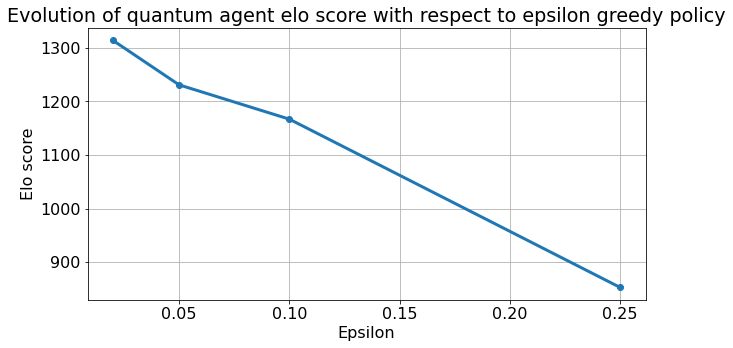

Then I have seen that quantum agent with epsilon 0.25 greedy policy has an elo score lower than 900.
So I'm playing against a very weak agent, and even in that condition I'm able to reach scores between
around 1350.

I believe that using epsilon greedy policy is good to explore the action space, but the other agents
should play as good as possible. One simple option is to sample the other agents just like I do
on evaluation. That way the agent should learn a q value function of that game distribution.

There is a risk of developing some greedy behaviours like jumping to a food when there is risk of
heating other geese. However it the agent develops that behaviour future agents won't do it because
they will die. So it seems that we can solve that problem simply by iteratively train more agents.

#### Second iteration: play against the best 5 agents

As explained above I will play against the best 5 agents, and I will use an epsilon of 0.1 instead
of 0.25.

| base agent            | elo multi | elo single |
|-----------------------|-----------|------------|
| quantum               | 1398      | 1421?      |
| 40k matches train     | 1238      | 1382       |
| 80k matches train     | 1290      | 1431       |
| 40k matches train it2 | 1259      | 1394       |

The agent develops greedy behaviours, even on the second iteration. Moreover it seems that the number
of matches is relevant, showing a clear improvement when using 80k matches instead of 40.

I could increase the number of matches if I use int8 for storing the data instead of float32.

I also have doubts regarding the reward, is the agent seeing 4 steps into the future?

#### Increase the number of matches

Let's study the influence of the number of matches int the agents performance. First I have to reduce
the size of the data and memory footprint of the data generation algorithm to enable using bigger
datasets.

To enable faster experimentation I'm thinking of going back to risk_averse_goose and use epsilon
greedy for all the players. That is what made quantum agent possible, maybe we can improve over it.

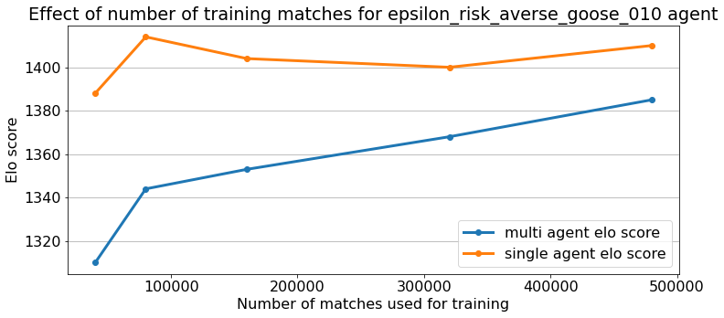

Increasing the number of matches from 40k to 460k had a significative effect on multi agent elo
score but not on single agent elo score. Due to uncertainty on elo score computation changes need
to be bigger than 35 to have 80% of confidence and 50 to have 95% of confidence.

#### Reward study

On a first step visualize games of the agent to see how far the agent foreseen into the future. After
that make changes on the reward and see how they impact on agent's performance.

| reward       | multi | single |
|--------------|-------|--------|
| reward_-4_4  | 1368  | 1375   |
| reward_-10_4 | 1362  | 1384   |
| reward_-7_3  | 1339  | 1356   |
| reward_-4_2  | 1300  | 1295   |
| reward_-4_3  | 1298  | 1399   |
| reward_-3_2  | 1291  | 1319   |
| reward_-1_1  | 1058  | 1053   |

There is a clear relation regarding window size, but the death reward does not seem to have a clear effect.

Let's try then with a bigger window size.

|              | multi  | single |
|--------------|--------|--------|
| reward_-10_5 | 1376.0 | 1363.0 |
| reward_-10_6 | 1385.0 | 1386.0 |
| reward_-10_7 | 1363.0 | 1382.0 |

It seems that 4 is an already good window size.

#### Architecture study

I have tried with variations over the architecture, and the changes are not significative.

|                           | multi  | single |
|---------------------------|--------|--------|
| 01_baseline_x128          | 1360.0 | 1391.0 |
| 02_tanh2                  | 1387.0 | 1391.0 |
| 03_all_relu               | 1344.0 | 1388.0 |
| 04_remove_one_convolution | 1360.0 | 1381.0 |
| 05_smaller_mlp            | 1330.0 | 1368.0 |
| 06_smaller_encoder        | 1352.0 | 1401.0 |
| 07_smaller_encoder_tanh2  | 1347.0 | 1417.0 |
| 08_smaller_encoder_tanh3  | 1325.0 | 1368.0 |

#### Epsilon risk_averse_goose to the limit

I'm going to lower the epsilon, and grow the number of matches as much as possible. Then I will
see if I can get a significative better result than the current one.

It seems likely that the lower the epsilon the more the games we need to correctly explore.

Results do not improve.

#### Summary

We have experimented with architecture, reward and number of matches without sucess. Let's try
to improve then the data distribution. I could decrease epsilon on risk_averse_goose to see
if there is any difference, or I could try with different exploration on q agent. First I want to
see plots of the influence of epsilon on the score.

#### Softmax policy exporation

It seems that we are blocked on ~1400 scores. No matter which agents we use to play we cannot improve. So let's try with softmax policy.

On a first step evaluate how well the model does on evaluation, and also measure how frequently selects non maximum actions depending on the temperature.

With this exploration the agent will not see many deaths from the epsilon greedy policy. So probably
the best option is to retrain the agent and save models every epoch because it may forget that
information.

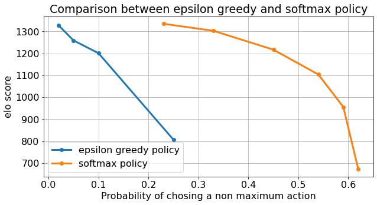

The plot shows that when using softmax policy we can achieve a much more random policy without hurting the score too much.

|         | multi | single |
|---------|-------|--------|
| quantum | 1347  | 1373   |
| it1     | 1415  | 1429   |
| it2     | 1409  | 1396   |

By surprise I have found that when being evaluated under same circunstances quantum agent gets a lower
score than the shown on the leaderboard.

#### Automating the improvement cycle

It is not clear if I'm doing progress, but I think I have to automate the process of data generation,
training and evaluation to be sure. Otherwise I only make one iteration and very likely many iterations
are needed to see improvements on the policy.

```python
for epoch in range(max_epochs):
    generate_train_data() #parallel
    train_model()
    evaluate_model() #parallel
```

I have been doing this on the notebook. The key change with respect to the first experiments is that
Data generation and evaluation will be done on parallel. Thus progress will be much faster.

I have to create the scripts to do this.

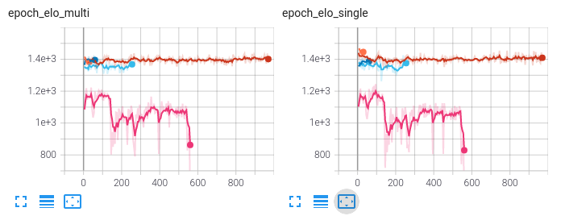

First experiments do not show signs of improvement. I'm going to try to train a model from zero
to see what happens.

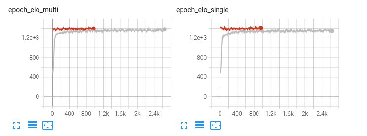

Train from zero is successfull and we can achieve a score close to the one that we got with the
pretrained model. In fact in less than one hour the model reaches a very good level of play.
However it is unclear why we reach a point where the model is not able to improve.
Let's think of explanations:

- Parametrization of the training is not optimal (learning rate, number of matches, softmax scale...)
- More model capacity is needed
- Q learning function does not allow to improve from there
- Maybe reward function should be different on the end of the game. It could be happening that terminal
state is reached frequently and the agent has learnt to survive until that state, but has not learned
that it needs to reach the final state on the first position.

Maybe I could try running multiple trainings from zero, and see how the hyperparameters affect those
experiments. Another option is to study matches from the best agent and try to understand why it is
unable to improve.

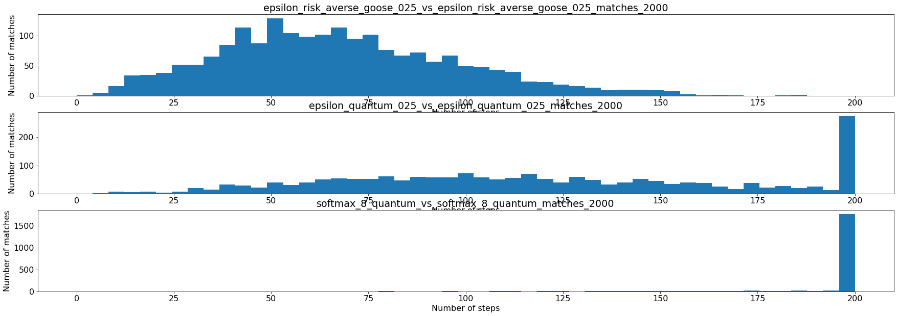

This plots are very relevant. Some insights:

- When using softmax policy almost all matches last 200 steps, the maximum.
- In the other hand with epsilon greedy policy this number is much more smaller.

So it seems that once the agent becomes too good to survive the whole match it struggles to improve.

Let's study those matches in more detail.

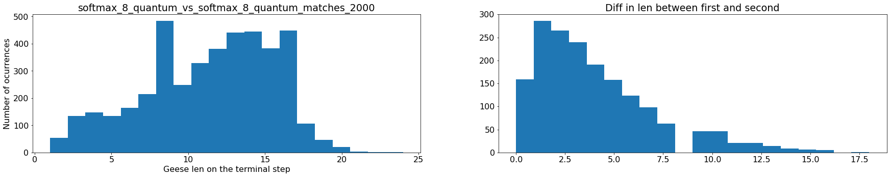

We can see that there is a lot of variation both in geese len and the difference between geese.

I think we need to update the reward, but not to modify the terminal state. If we modify the terminal
state it will have small impact on the geese learning. I think we should reward when a geese is growing
to catch up with the first one, and also to reward the first one when it grows, but not to encourage too much growing.

Currently a goose is only rewarded based on its ranking, which is good but it is sparse.

#### New reward: clipped len

The new reward is simply the difference in length between the goose and the leader. If the goose
is the leader then it's the difference with the second largest goose. Both values are clipped.
This gives a more informative when the goose is growing but has not improved ranking, it also
discourages the leader for becoming too big.

However after training with this reward I get very similar results, there is no improvement. When
observing the matches I notice that I was using a window of 4, and for many of the deaths it was necessary
to look further into the future. Thus I have tried training a model with a window of 8, and after
decreasing the learning rate it seems to be achieving better scores than previous experiments.

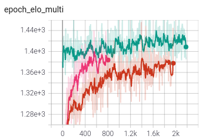

The pink line learns faster, and the green one achieves higher scores after decreasing the learning rate.
So it seems that increasing the window size had a positive effect on learning speed, and that we had
to decrease the learning rate to enable learning more subtle variations of the q learning function.

#### New reward: grow and kill

This reward will give +1 when the goose grows (except when it's the leader and already has some distance
with the second) and also when other goose die.

It's similar to the previous reward but more simple because the range of rewards is much more limitted.
That may help learning.

Surprisingly it achieves worse results than the previous reward.

#### Could be a matter of scale?

In the [forum](https://www.kaggle.com/ks2019/handy-rl-training-notebook) it is said that
[HandyRL](https://github.com/DeNA/HandyRL) example was trained for 800k matches.

In the other hand the last training played only ~50k matches in 7 hours. Only half of that time was
devoted to playing, the rest was devoted to evaluation. I'm able to play around 5 matches per second.
If we estimate the mean match length to be 150 that is 750 steps per second.

For playing and evaluation I use cpu and parallelization. The whole cpu is used, so there is no
room for improvement there. However I believe that a big jump could be made if using gpu for playing.

However to make gpu faster than cpu I have to made multiple predictions, not one by one. Thus I should
create a way to play in multiple matches at the same time.

### Results

On this iteration I have:

- Started to use softmax exploration instead of epsilon greedy
- Automated the process of playing, training and evaluation
- Understood that we need to look far in the future for take good decisions
- Could not improve significatively the quantum agent score

## Iteration 5. Scale Q learning

### Goal

The goal of this iteration is to use gpu for playing games and thus be much faster and train on a much
bigger number of matches.

### Development

#### Theoretical numbers

On last iteration we saw that we were able to play around 5 matches per second when using all the
cpus. Let's get a number for prediction speed.

```
20 cores/5 matches/4 players/150 steps *1000 miliseconds = 6.6 miliseconds
```

In that time it is included running the environment and preparing the input for the model, not
just the model prediction.

#### Experimental numbers

| batch | cpu mean sample prediction time  | cpu speedup | gpu mean sampling time |       |
|-------|----------------------------------|-------------|------------------------|-------|
| 1     | 3537                             | 1.0         | 6849                   | 0.5   |
| 2     | 2520                             | 1.4         | 3949                   | 0.9   |
| 4     | 1232                             | 2.9         | 1653                   | 2.1   |
| 8     | 474                              | 7.5         | 880                    | 4.0   |
| 16    | 246                              | 14.4        | 339                    | 10.4  |
| 32    | 160                              | 22.1        | 149                    | 23.7  |
| 64    | 102                              | 34.7        | 115                    | 30.8  |
| 128   | 56                               | 63.2        | 55                     | 64.3  |
| 256   | 35                               | 101.1       | 25                     | 141.5 |
| 512   | 21                               | 168.4       | 19                     | 186.2 |
| 1024  | 14                               | 252.6       | 12                     | 294.8 |
| 2048  | 10                               | 353.7       | 7                      | 505.3 |
| 4096  | 7                                | 505.3       | 6                      | 589.5 |
| 8192  | 10                               | 353.7       | 7                      | 505.3 |

- For this model using gpu for prediction does not bring improvements, probably it does for training
but not for prediction
- We can get speedups up to 500 if we make predictions using big batch size such as 4096.
- However in this table we are missing the paralelization of doing multiple predictions at the same time

| batch | cpu mean sample prediction time  | cpu speedup | parallelization factor | Ideal matches/second | matches speedup |
|-------|----------------------------------|-------------|------------------------|----------------------|-----------------|
| 1     | 3537                             | 1.0         | 20.0                   | 9                    | 1               |
| 2     | 2520                             | 1.4         | 20.0                   | 13                   | 1               |
| 4     | 1232                             | 2.9         | 20.0                   | 27                   | 3               |
| 8     | 474                              | 7.5         | 20.0                   | 70                   | 7               |
| 16    | 246                              | 14.4        | 20.0                   | 136                  | 14              |
| 32    | 160                              | 22.1        | 20.0                   | 208                  | 22              |
| 64    | 102                              | 34.7        | 20.0                   | 327                  | 35              |
| 128   | 56                               | 63.2        | 16.0                   | 476                  | 51              |
| 256   | 35                               | 101.1       | 8.0                    | 381                  | 40              |
| 512   | 21                               | 168.4       | 4.0                    | 317                  | 34              |
| 1024  | 14                               | 252.6       | 2.0                    | 238                  | 25              |
| 2048  | 10                               | 353.7       | 2.0                    | 333                  | 35              |
| 4096  | 7                                | 505.3       | 2.0                    | 476                  | 51              |
| 8192  | 10                               | 353.7       | 2.0                    | 333                  | 35              |

If we take into account parallelization it seems we could get around 50x speedups.
For example using a batch size of 128, which implies playing 32 matches at the same time would
result on a speedup of around 50.

However we are ignoring that current implementation is more eficient in the sense that when an agent
has died it no longer wastes resources.

#### Better comparison with HandyRL

> P.S. It took 1 day with 1 GPU and 64 CPUs to train the shared model.
> It took around 1,500 epochs with 800,000 games.
> That gives a rough speed estimate of around 9 matches per second (excluding training)

If we realize that I only have 20 cpus then my speed of 5 matches per second is not that bad.

So maybe instead of focusing on playing speed I should optimize train data generation, or run
evaluations less frequently.

#### Increase model capacity

So I'm going to train on the best configuration so far increasing the model capacity and doing
evaluation only each 20 epochs. This will make the learning faster.

I don't like the oscilatory behaviour that I see on the loss, some ideas to improve it:

- Increase the number of matches of play: Does not seem to fix the issue.
- Decrease the number of epochs that we train on the data: I have found that training for more epochs than 5
is beneficial. This may have sense because our data augmentation multiplies the data by 24. Thus I
have updated the script to use all data augmentations.
- Decrease the learning rate (this did not seem to have effect on a previous experiment)
- Maybe it is simply randomness or surprise on the metrics

#### Why the problem is very hard

##### Hyperparameters

- Which agents to choose to play with
- Reward (I have already designed 4 different rewards)
- Model architecture
- Exploration policy
- Learning rate
- Number of matches to play
- Number of epochs to train

All these hyperparameters could be harming the learning capacity of the model.

#### Making a submission

It seems that the submission needs to be a single python file with all the code inside (and also the model)

- https://www.kaggle.com/nejumi/let-s-create-your-agent-by-supervised-learning/
- https://www.kaggle.com/nejumi/keras-model-trained-by-imitation-learning

By looking at those example I have been able to create my first submission.

After a day submissions have a score between 800-900, which sits in the middle of the leaderboard.

#### High variance on Monte Carlo methods

Montecarlo estimates have high variance, whereas temporal difference methods do not.

- https://stats.stackexchange.com/questions/336974/when-are-monte-carlo-methods-preferred-over-temporal-difference-ones
- https://ai.stackexchange.com/questions/17810/how-does-monte-carlo-have-high-variance

> In practice, TD learning appears to learn more efficiently if the problems with the deadly triad can be overcome. Recent results using experience replay and staged "frozen" copies of estimators provide work-arounds that address problems - e.g. that is how DQN learner for Atari games was built.

> In terms of "practical advantage" for MC? Monte Carlo learning is conceptually simple, robust and easy to implement, albeit often slower than TD.

So maybe that is what is blocking me on 1400 elo score.

Without changing to temporal difference I only see two options to deal with the high variance:

- Increase the number of matches
- Reduce the learning rate

However increasing the number of matches will only make that when we update the model we use more
data. It won't have any impact on learning or in the variance. It may reduce the variance of the
loss metrics, because we use a bigger dataset for creating that losses, but won't have too much
impact on the learning of the model.

So that leaves only the tool of learning rate. We have to experiment with smaller learning rates.

It seems that decreasing the learning rate is having a clear effect on the loss, which is more
stable. However we have to wait to see if that translates into a better elo score.

### Results

Although I have been able to speed up training I have been unable to train a better model than Quantum.
Thus instead of using Monte carlo to estimate the reward I'm going to switch to Q* learning on the next iteration.

## Iteration 6. Deep Q* Learning

### Goal

The goal of this iteration is to try to create an agent that is consistently better than quantum
agent by applying Deep Q* Learning.

We have seen that there is a wall around 1400 elo score that models trained with monte carlo
returns cannot pass. Hopefully using temporal difference for learning will break that wall.

### Development

#### Implementation

I would like to make the minimal changes to existing code on a first step to enable to most fair
comparison with monte carlo.

I have identified the following changes that are needed:

- is_terminal_state, I need to save this data in order to be able to compute the target reward
- opposite_action_mask, This is needed to filter that action previously to applying max operator.
I think I can have this mask simply by rotation the action array by 2.
- do not acumulate reward, I need the reward at each step

When training I will load the data, that should be sorted, compute the target values and train.

First training yields a score above 1500, which  was the goal when I started training agents. So
I'm very happy with it. Hopefully we can achieve even higher scores.

#### WallBreaker: a new agent to the pool

I'm going to add this new agent wallbreaker with a elo score of 1515 to the pool of agents. I think
it has sense to add a new agent each 100 elo points. I will also make a submission with it.

The name comes because there was a wall on 1400 elo score that was broken this night.

#### Logging evolution of Q value

In the Atari paper it is said that logging the evolution of Q value over random play episodes is a
good indicator of the convergence of the algorithm.

> We collect a fixed set of states by running a random policy before training starts and track the average
of the maximum predicted Q for these states. The two rightmost plots in figure 2 show that average
predicted Q increases much more smoothly than the average total reward obtained by the agent and
plotting the same metrics on the other five games produces similarly smooth curves.

Thus it has sense to do the same because it may be useful to tune the hyperparameters.

#### Experience replay

> We trained for a total of 10 million frames and used a replay memory of one million most recent frames.

I'm going to do something similar to this. I will save data from each epoch on a different file. When
going to train I will load the last data and random n aditional files of the last m epochs. Thus I
have two parameters to play with. I don't think I could use more than ~5 files for training due
to RAM memory issues, but I don't expect that would be necessary.

So I have to first implement that and then test if it improves learning.

#### Hyperparemeter tuning

I can identify 3 major factors that we have to study:

- Model capacity
- Reward function and discount factor
- Experience replay

I have been doing fast experiments of 80 epochs, where the model sees a total of 64k matches. I have the feeling
that is not enough. So I'm going to run experiments 4 times longer to better measure the effect of the
parameters.


```python
import glob
import os
import time

while 1:
    time.sleep(2)
    filepaths = sorted(glob.glob('/mnt/hdd0/Kaggle/hungry_geese/models/35_deep_q_learning/*/train_conf.yml'))
    print(filepaths)
    for filepath in filepaths:
        if os.path.exists(os.path.join(os.path.dirname(filepath), 'logs')):
            continue
        os.system('python deep_q_learning.py %s' % filepath)
history
```

I'm going to first study the optimal learning rate for the current architecture, then I will start
applying experience replay.

#### Torus model

I have seen in the forum that people are using a Torus convolution. Instead of adding black borders
to keep the convolution size constant, they repeat the board. This has sense because the board has
no end, it is a torus.

Thus I would like to try that approach.

- https://www.kaggle.com/nejumi/keras-model-trained-by-imitation-learning
- https://www.kaggle.com/yuricat/smart-geese-trained-by-reinforcement-learning

Moreover the proposed architecture is much more deep than mine, although less wide.

First experiments do not yield improvements, and the model is slower, so I'm keeping to the initial
simpler model by now.

#### Data augmentation at test

I have experimented with data augmentation at prediction, and elo score improves slighlty.

| model                         | elo single | elo multi |
|-------------------------------|------------|-----------|
| wallbreaker                   | 1513       | 1507      |
| wallbreaker_data_augmentation | 1541       | 1529      |

#### Training for longer

Since I don't see improvements I'm going to train for longer. Instead of using 320 epochs I will use
1500 epochs. That would take around a day for the baseline model and would be a total of 1.2 M of episodes
(300k unique episodes).

### Reflections

It is surprising that an apparent simply game is so hard to learn, at least to play it at a high level
(because the model is able to achieve good score quite fast).

Why it takes so long to improve or learn? My first intuition is that typically on machine learning
we learn from zero, whereas humans do have a lot of experience when they learn to play a game. This
gives me two ideas:

1. One way to speedup learning is to reduce the search space. One way would be to prevent trying
movements that will lead to a certain death. Another option will be to have the geese always oriented
in the same position and only 3 movements allowed.
2. The second option is to use a model of the game for planning. We do not need to learn a model if
it is already available. We could try a system such as alphazero where the predictions of the model
are used to guide the planning search.

As a more general reflection for the future this highlights the difficulties of reinforcement learning.
I think it validates my intuition that imitation learning or pretraining should be the way to go.

#### Reduce the search space by avoiding certain deaths

The idea is to create a function that returns a binary mask for the movements that will have ones
on those movements that lead to death. This way the agent will avoid stupid deaths and could focus
its energy on learning a more advanced policy.

#### Discount factor and Q* learning

When I started the challenge I tried with Q learning and I remembering having to decrease the discount
factor or the window size because the function was undetermined. When the game started it was very
difficult to predict the final position of the player, furthermore if playing against the same
agents where we always have the same distribution of final positions.

However in Q* learning that is not the case because we are predicting what the final position will
be if the player acts optimal on following steps. So we can increase the discount factor and see
that it has a desirable effect on some of the metrics, althought not in the most important one which
is elo score.

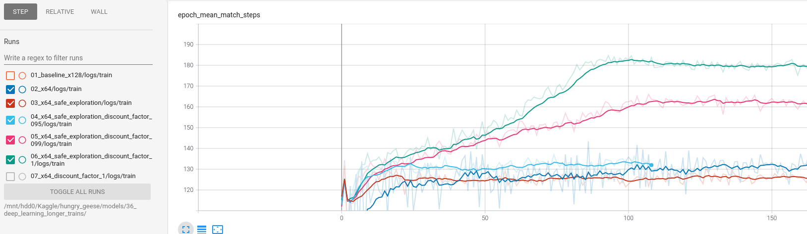

This may be an explanation for the wall we were seeing when doing Q learning. We were limited by the
small window size and also for learning with self-play.

This is clearly game-changing. On all previous experiments I was reaching a mean number of game steps
around 130 and now I'm reaching 180+ simply by changing the discount factor and playing safe.

However when visualizing games we have seen that the model has not learned a good enough reward function,
sometimes ignores food and sometimes does not know that death is ahead.

#### Playing against top n agents

As it seems that when learning by self-playing the train metrics and elo score are disconected I have
decided to play agains the top n frozen agents. This should give a much more direct relation between
train metrics and elo score.

I'm going to run some initial experiments and after that I will try using 2 learning agents and 2 frozen
agents. This will prevent the learning agent from developing some greedy behaviours and at the same
time it will be playing against the top agents. I would also like to try using frozen agents experience
for learning.

First experiment from zero training with two agents vs the two top agents is very succesfull and it's
the first since a long time that is consistently improving over the best agent. **Thus it seems that
playing against a frozen agent is better than playing against a learning agent** I'm going to run another
one only against the top agent to see if that is enough.

#### Safe agents

As a closing point I will like to dig deeper into safe agents because they should perform better
than free agents. Maybe I should simply apply death penalty and forget near-death situations.

After some thoughts I believe **safe agents have sense on evaluation**, they could be helpful when the agent
has not learned correctly. I should only apply certain death penalty. However when learning (when playing
to gather experience) probably is not a good idea because the model needs to learn when there is a
certain death. If I apply those penalties it will be more difficult to learn.

TODO: evaluate best agents from previous experiment with and without safe agents

#### Populating the agent pool

> Elo only really works when you’re playing others of similar skill levels

That sentence is taken from this [post](https://medium.com/acolytefight/elo-sucks-better-multiplayer-rating-systems-for-smaller-games-8ca588ee652f)
If that is true as I think it is, playing against agents with a score lower than 400 will lead to
volatility in scores and bad estimations.

The solution is to add new agents more frequently, for example each 50 elo points.

#### Using all the available time

In the rules it is said that we have 1 second per movement and also aditional 60 seconds.

I have made a test on a notebook on Kaggle and the current agents (for example rhaegar) use less
than 4 ms to take a decision. Thus there is a lot of spare time to improve the decision.

On the past I have tried using data augmentation, but the improvement is not very big. I think it is
much more interesting to use an ensemble of agents to predict the value of each action. I'm currently
using around 2 MB of size, so I could add up to 50 models.

I should automate the process of creating this ensemble agent because otherwise it will be very
cumbersome to copy the weights of all the models by hand.

I have made submissions with 45 models and they do not get better results than simply rhaegar agent.

Contrary to the intuition data augmentation works better than using multiple agents (at least when
all the agents come from the same training)

#### Score a basket

I have seen two times (with rhaegar and icedragon) that for 3 submissions one gets very lucky and reaches
around 1075 elo score while the others remain around 1000.

This is probably due to small number of evaluations. Once now I simply have to make multiple submissions
for each agent to see where the lucky one can get. It is very likely that the other people in the challenge
is already seeing the same behaviour.

#### Just survive reward

I'm struggling to improve over rhaegar agent, so I want to explore if modifying the reward I can improve
the agents.

There are two competing goals in the game:

1. Survive until epoch 200
2. Be the biggest goose at epoch 200. This could be done by eating more or killing other geese

I think they are competing because a smaller goose can move in circles and thus survive in a small
area whereas a big goose cannot. To verify this hypothesis I'm going to train an agent that receives
a negative reward when it dies an zero reward otherwise.

Althougth simple this experiment reveals interesting facts:

- Gets similar elo scores to the previous reward
- Predicts a state value higher than zero, even when it receives just zero or negative reward
- Mean match steps grows faster than previous reward but soon they are equal

If I run a match with only just survive agents they all survive until epoch 200. And the estimation
of the Q value decreases along the match but starts close to 2. This may be caused by usign a discount
factor of 1. If there is a bias of 0.01 in the estimation of value state then acumulated over 200
steps it will grow to 2.

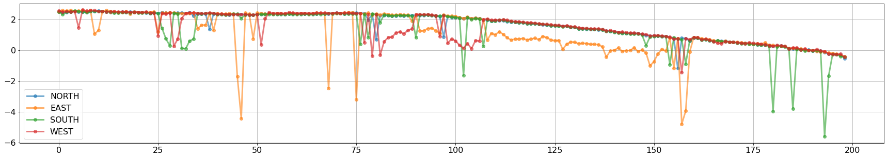

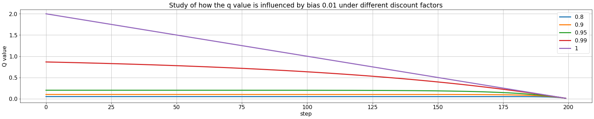

It seems that simply using a discount factor of 0.95 is enough to stabilize growing bias. So let's
try that on a training and compare to discount factor 1. This will probably help to better estimate
q value, but I have better ideas.

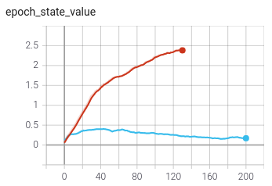

The discount factor of 0.95 seems to lead to a more real q value, but other metrics are no better.

Currently I'm only using for training the action that the agent took. However I could also use
the information of certain deaths and thus provide more information to the agent to learn even if it
did not took those actions. Furthermore if I do that it makes sense to play using safe agent. However
this implies some changes on architecture, on how data augmentation is applied...

### Results

I have been able to train an agent WallBreaker over 1500 at the first experiment, a clear sign that
temporal difference learning is better than monte carlo returns on this setup,  however it's
being quite difficult to improve from there.

First experiments do not show clear changes between different architectures or when using experience
replay. Batch normalization does not seem to bring improvements and makes the model much slower.
I was training for 320k epochs, maybe longer trainings are needed. For example for wallbreaker
model I trained for more than 600k epochs. Let's try with longer trainings.

After started playing against frozen agents I have been able to improve over WallBreaker. With agent
icedragon I have been able to reach position 16 on leaderboard with 1088 points, although it's probably
just luck and I will go down in the next days.

I should be aiming at 2000 elo score to be close to the first positions on leaderboard.

## Iteration 7. The great redesign

### Goal

After achieving some impressive but temporal results on leaderboard (position 11 and gold medal) I think
we can improve over current Deep Q* Learning implementation and maybe secure a gold medal. Then we could
move to Monte Carlo Tree Search and Alpha Zero like agent.

### The great redesign

#### Changes

- The agent is always centered and looking upwards
- Only 3 actions: forward, left and right
- Always play safe, never moving to certain death positions (unless all moves lead to death)
- Use certain death actions to train the model, as well as the true action

#### Advantages

- No need to apply vertical simmetry because the agent is always looking upwards. This
simplifies the game
- Search space is reduced because there are only 3 actions, and they always mean the same
- Don't need to care about ilegal actions, all 3 actions will always be legal
- Lower computational cost due to removing simmetries from training -> 1/2
- Exploration will be improved because certain deaths will be avoided
- Learning will be improved because not just the action but certain death actions will be used to
learn the q* value function

#### Disadvantages

- To enable the agent always looking upwards I have to increase the size of the board to be squared
- On the first move of each match there is an extra complexity because I need to try at least with
two different previous actions
- Changes won't be retrocompatible, only self-contained agents will still work
- Higher computational cost due to increased board size

#### Uncertainties

- How to deal with breaking changes? I would like to be able to keep training models and at the
same time develop and test the redesign. If I want to use both implementations at the same time I
need to have two copies of the repository and also two conda environments, that's the only way. A
simpler option is to use a different branch for working and to stop training when developing. I prefer
this one for simplicity. Most of the time I won't be developing.
- How to deal with uncertain death actions? Those are the actions that depending on the actions of
the other goose may lead to death. One argument is that the model should learn to deal with those
actions, sometimes it will pay to take the risk and sometimes it won't. Other argument is that first
priority is survival so we have to avoid taking those actions. Maybe I should leave this for later.

### Development

#### The model grows because of bigger input size

I have added an aditional convolutional layer to reduce board encoder output size. Otherwise the dense layer was too big.
This increases model capacity from 415k to 628k parameters.

```bash
__________________________________________________________________________________________________
Layer (type)                    Output Shape         Param #     Connected to
==================================================================================================
board_input (InputLayer)        [(None, 7, 11, 17)]  0
__________________________________________________________________________________________________
conv2d (Conv2D)                 (None, 5, 9, 128)    19712       board_input[0][0]
__________________________________________________________________________________________________
conv2d_1 (Conv2D)               (None, 3, 7, 128)    147584      conv2d[0][0]
__________________________________________________________________________________________________
conv2d_2 (Conv2D)               (None, 1, 5, 128)    147584      conv2d_1[0][0]
__________________________________________________________________________________________________
flatten (Flatten)               (None, 640)          0           conv2d_2[0][0]
__________________________________________________________________________________________________
features_input (InputLayer)     [(None, 9)]          0
__________________________________________________________________________________________________
concatenate (Concatenate)       (None, 649)          0           flatten[0][0]
                                                                 features_input[0][0]
__________________________________________________________________________________________________
dense (Dense)                   (None, 128)          83200       concatenate[0][0]
__________________________________________________________________________________________________
dense_1 (Dense)                 (None, 128)          16512       dense[0][0]
__________________________________________________________________________________________________
action (Dense)                  (None, 4)            512         dense_1[0][0]
==================================================================================================
Total params: 415,104
Trainable params: 415,104
Non-trainable params: 0
__________________________________________________________________________________________________


Layer (type)                    Output Shape         Param #     Connected to
==================================================================================================
board_input (InputLayer)        [(None, 11, 11, 17)] 0
__________________________________________________________________________________________________
conv2d (Conv2D)                 (None, 9, 9, 128)    19712       board_input[0][0]
__________________________________________________________________________________________________
conv2d_1 (Conv2D)               (None, 7, 7, 128)    147584      conv2d[0][0]
__________________________________________________________________________________________________
conv2d_2 (Conv2D)               (None, 5, 5, 128)    147584      conv2d_1[0][0]
__________________________________________________________________________________________________
conv2d_3 (Conv2D)               (None, 3, 3, 128)    147584      conv2d_2[0][0]
__________________________________________________________________________________________________
flatten (Flatten)               (None, 1152)         0           conv2d_3[0][0]
__________________________________________________________________________________________________
features_input (InputLayer)     [(None, 9)]          0
__________________________________________________________________________________________________
concatenate (Concatenate)       (None, 1161)         0           flatten[0][0]
                                                                 features_input[0][0]
__________________________________________________________________________________________________
dense (Dense)                   (None, 128)          148736      concatenate[0][0]
__________________________________________________________________________________________________
dense_1 (Dense)                 (None, 128)          16512       dense[0][0]
__________________________________________________________________________________________________
action (Dense)                  (None, 3)            384         dense_1[0][0]
==================================================================================================
Total params: 628,096
Trainable params: 628,096
Non-trainable params: 0
__________________________________________________________________________________________________

```

#### Why reducing the number of actions to 3 did not improve model?

Unfortunately we have not been able to improve over previous 4 action model.

Let's enumerate all the changes:

- Actions reduced from 4 to 3
- Model size increased from 400k to 600k
- Board size increased from 7x11 to 11x11
- Training samples reduced to half due to removing vertical simmetry

Maybe there is another limitting factor that is hiding a possible improvement, such as the reward or
the fact of using two learning agents for playing.

**WARNING** I have found a bug days later that was creating incorrectly train data, the board
was not north oriented. So this could explain the bad results.

#### Using experience replay

I have done a experiment using experience replay and again does not seem to bring improvements to the
agent.

#### Risk averse agent

I'm going to modify safe agents so they do not take risks except when there is not other option.

- This will ease the task of survival, which we have seen in the leaderboard that sometimes an agent
dies early playing against weak agents
- It will allow to train using a single learning agent, because it will not learn greedy behaviours.
This may help to allow developing strategies to beat the top agents

In the other hand it is possible that taking risks when the other agents do not take them (at the top
of the leaderboard) may be giving an advantage to my current agents against the others.

#### Using certain deaths for training

To be able to use certain deaths for training I will need to create this data:

- reward for each action
- is_terminal for each action
- mask for training

The model will receive as input the board and the features, and as output will receive the q value
and the mask. I will have to create a custom loss function to make it work.

I think the best way to do this is to create a new branch.

#### Semi safe agents

I have been training a safe agent on `07_learn_from_certain_deaths_fixed_bug` but it gets stuck below
a score of 1500. So instead I have decided to train a semisafe agent `08_learn_from_certain_deaths_fixed_bug_semi_safe`.
This experiment will show if only taking safe movements is limitting the growth of the agent.

After one day results are not very different, so I cannot draw conclusions.

#### Speedup training

I have tried decreasing the number of matches played on each iteration from 1000 to 100, and to compensate
the smaller diversity of matches when training use a experience replay of size 10.

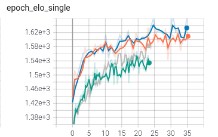

- blue 10_same_but_discount_factor_1
- orange 09_try_to_speedup_learning
- grey 08_learn_from_certain_deaths_fixed_bug_semi_safe
- green 07_learn_from_certain_deaths_fixed_bug

If we look at elo single score we can see that these models learn much faster (blue and orange) and achieve
higher scores.

#### Epsilon greedy again

After implementing the semi safe agent I have decided to try again with epsilon greedy agents again
because if we avoid simple deaths that agent has a closer policy to production. So it may learn better.

The agents seem to be slightly better than softmax. So we have made the full circle: started with epsilon-greedy,
switch to softmax, and back to epsilon greedy after playing safe.

### Results

I have implemented a great redesign in the code and in the agents. However I have not been able to improve
the scores yet. I have discovered a bug in the representation of the state of the game that was creating
wrong representation for agents with idx != 0. I believe this was causing a wall around 1700 elo score.
On the next iteration we will fix that error and hopefully continue climbing the ladder.

## Iteration 8. The great bug

### Goal

The goal of this iteration is to fix the bug in all the agents and run new trains with the hope that
this will allow to create new and much more powerful agents.

### Development

#### Explain the bug

The bug was creating bad state representations for agents that where on a slot different than the first one (there are four slots because it's a four player game).

#### Why I didn't see the bug until now

Previously I was playing with two agents, so it is likely that the model learned to deal with
this problem in the data. However now I'm playing with a single learning agent, and thus
when the agent falls in another slot the score drops a lot.

#### Jump on score after fixing the bug

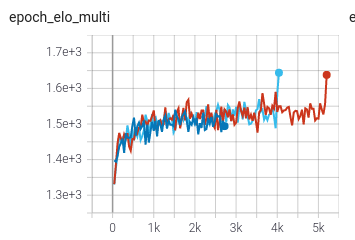

The last point in the plot shows a jump in elo multi score of around 100 just by fixing the bug.

#### Correcting frozen agents elo score

| model       | ranking | new_ranking | diff |
|-------------|---------|-------------|------|
| rhaegar     | 1680    | 1612        | -68  |
| balerion    | 1638    | 1565        | -73  |
| icedragon   | 1602    | 1562        | -40  |
| iceberg     | 1548    | 1490        | -58  |
| wallbreaker | 1515    | 1460        | -55  |
| ram         | 1463    | 1450        | -13  |
| clasic      | 1365    | 1314        | -51  |

We can see that we get lower elo scores after fixing the bug.

#### Train new agents

I have launched two new trainings. My hope is that after fixing the bug I will be able to create a new
generation of more powerful agents.

After five days of training the model with discount factor 1 is clearly better than the one with 0.95. However it only reaches the level of the best agent without surpassing it.

#### Add more metrics

I have added new metrics to be able to track better the agent performance during training:

- terminal_rewards_negative_ratio (death ratio)
- terminal_rewards_non_negative_ratio (reach the end ratio)
- terminal_rewards_positive_ratio (win ratio)

#### Epsilon greedy policy limitting agent learning

When exploring the training data to create the new metrics I have realized that many of the deaths
were caused by the epsilon greedy policy that was choosing a bad action that lead to death.

| epsilon | epoch_mean_match_steps | epoch_mean_goose_size | terminal_rewards_negative_ratio |
|---------|------------------------|-----------------------|---------------------------------|
| 0.1     | 130                    | 8.5                   | 0.75                            |
| 0.05    | 130                    | 8.5                   | 0.75                            |
| 0.02    | 160                    | 10.5                  | 0.46                            |
| 0.01    | 160                    | 10.5                  | 0.46                            |
| 0       | 160                    | 10.5                  | 0.46                            |

The jump in performance is quite big. I was expecting a gradual shift but it did not happen with the
chosen values (it may appear if using 0.04 and 0.03).

I have launched longer trainings with 0.02 and 0.01 to see if epsilon was limitting the growth of
the agents.

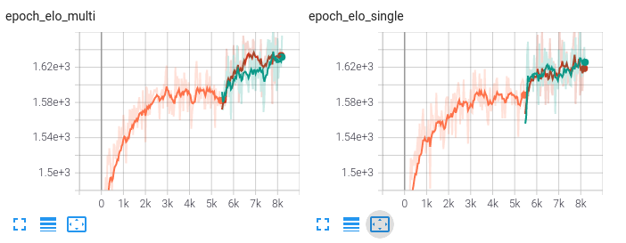

There is a clear jump in score when reducing epsilon, so it was clearly hurting the model capacity.

#### Train from zero to see metrics evolution

I'm going to train from zero with epsilon greedy 0.01 to see how the metrics evolve over time.

### Results

I have been able to train a new better agent `gargantua` that scores 1627 on noramal mode and 1667 on
data augmenation model.

<!---

## Iteration 8. Monte Carlo Tree Search

### Goal

The goal of this iteration is to try using Monte Carlo simulations to play. This is an intermediate
step to applying an alpha zero algorithm.

### Motivation

One of the reasons for reinforcement learning being so slow and resource intensive is that each agent
has to learn everything from zero. However that is not mandatory, we already have a model of the game
that could be used for playing.

So in this iteration I will explore how far can we go without training an agent, just using the
game engine to simulate monte carlo rollouts.

### Theory

The RL book by Sutton and Barto does not talk about Monte Carlo simulation for playing, because it focus
on learning and that method does not learn.

- https://en.wikipedia.org/wiki/Monte_Carlo_tree_search
- https://towardsdatascience.com/monte-carlo-tree-search-in-reinforcement-learning-b97d3e743d0f

The Hungry Geese game is different to chess in that all the players move at the same time and that
there is randomness of where the food appears.

#### Game complexity

https://en.wikipedia.org/wiki/Game_complexity

| Game                              | Board size (positions) | State-space complexity (as log to base 10) | Game-tree complexity (as log to base 10) | Average game length (plies) | Branching factor |
|-----------------------------------|------------------------|--------------------------------------------|------------------------------------------|-----------------------------|------------------|
| Tic-tac-toe                       | 9                      | 3                                          | 5                                        | 9                           | 4                |
| Backgammon                        | 28                     | 20                                         | 144                                      | 55                          | 250              |
| English draughts (8x8) (checkers) | 32                     | 20 or 18                                   | 31                                       | 70                          | 2.8              |
| Connect Four                      | 42                     | 13                                         | 21                                       | 36                          | 4                |
| Chess                             | 64                     | 47                                         | 123                                      | 70                          | 35               |
| Go (19x19)                        | 361                    | 170                                        | 360                                      | 150                         | 250              |
| Hungry Geese                      | 77                     | 63                                         | 382                                      | 200                         | 81               |

Those estimations do not take into account the random nature of the game, which will increase the game-tree
complexity by a very big factor. This highlights that even when the rules are very simple the size
of the game is huge.

### Development

Before reading or implementing anything I already identify that one relevant aspect of MC is speed
of simulation and also pruning of the search space. For example avoiding actions that lead to the
death of the agent. The more the simulations we can run the better the estimate of the value of
each action will be.

The goal is to estimate the value for the three available actions of the agent. I don't have to train
anything but I do have to evaluate the agent. Evaluations will likely be more slow because I will have
to use as much time as possible computing the rollouts.

#### Start point from the forum

https://www.kaggle.com/johntermaat/hungry-geese-simple-monte-carlo-baseline?scriptVersionId=54912468

- Builds its own simulation
- Does not take into account elapsed time

### Results


What are the advantages of Q* learning? Check paragraph from Atari paper.
Also there is no proof of convergence.

Next iteration should be about using a model for planning

## Iteration n. title

### Goal

### Development

### Results


https://towardsdatascience.com/understanding-actor-critic-methods-931b97b6df3f
--->
