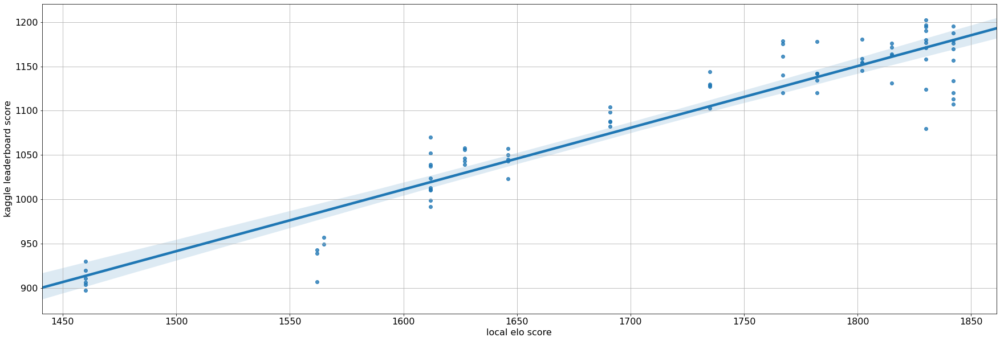

# Solution Summary
<!---https://www.kaggle.com/wiki/WinningModelDocumentationTemplate --->

## Solution summary

### Evolution of agent scores over time

- We can see that the is a pretty good correlation betweeen local and leaderboard score.
It is not perfect, but the relation is clear.
- Also we can see how wide the distribution of scores can be for the same agent
