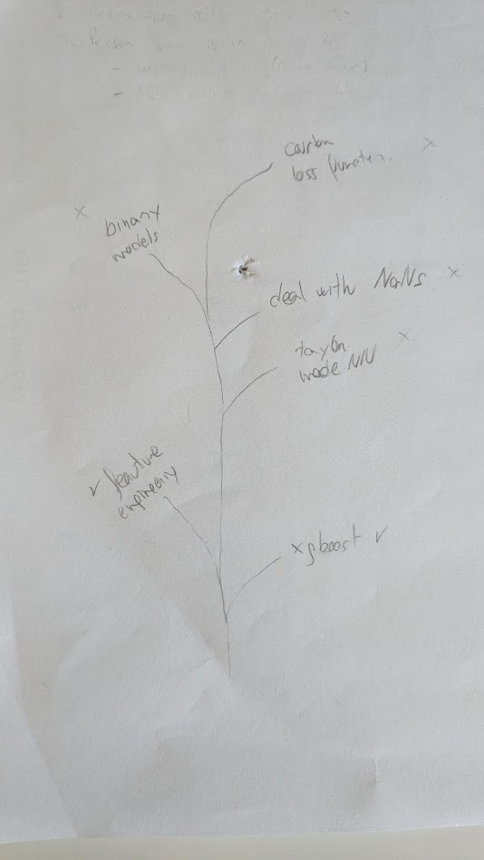

# Solution Summary
<!---https://www.kaggle.com/wiki/WinningModelDocumentationTemplate --->

## Solution summary

My solution was xgboost tuned with hyperopt and automated feature engineering. One limitation was the
statistical significance of the experiments that made me run each experiment many times to be able
to decide if it was improving or not.

I tried using Neural Networks but unfortunately they did not work well.

## Learnings

- Doing a small number of submissions at the start is fine, but if all are going to be used for
selecting the best submission on the test set then it has more sense to make as much submissions
as possible at the end
- It's hard but on the last days of the challenge I have to keep focus and thinking of ways of improving.
I think I had too much confidence on my solution.
- Statistical significance is very important
- I had to be more participative in the forums, it will be more fun
- Even if the final position is not in the prize, it was really interesting and enjoyable taking
part in the competition. I really like competitions.
- I should have seen some signs of overfitting to the leaderboard
